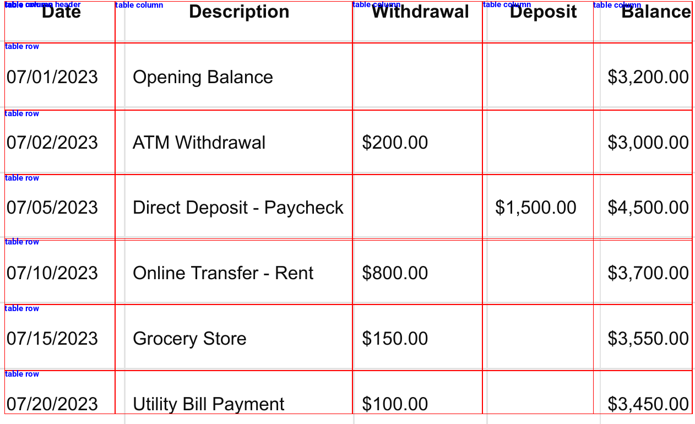

# AMAI_Exam_Group_Q

# Use the link below to open the Colab notebook 

# For input, the bank statement pdfs are uploaded in 'Bank_statements_PDFs'.  

# PDF Table Extractor for Bank Statements
A Python tool that detects and extracts tabular data from PDF bank statements using deep learning models and OCR. Outputs structured data in CSV format.

## Features
- Table detection using Microsoft's Table Transformer
- Table structure recognition (rows/columns)
    
    
- Dual OCR validation with EasyOCR and Tesseract
- Automatic CSV generation with data cleaning
- PDF-to-image conversion support

# Please upload the pdfs in in colab notbook before running

# Workflow : 

1. PDF to Image Conversion:
The input PDF is converted to an image using pdf2image and poppler-utils.

2. Table Detection:
The Table Transformer model detects table boundaries in the image. Bounding boxes are drawn around tables using coordinates from model predictions.

3. Table Cropping:
The detected table region is cropped from the image for further processing.

4. Table Structure Recognition:
A second Transformer model identifies internal structures (rows, columns, cells) within the cropped table image.

5. Cell Coordinate Calculation:
Rows and columns are sorted, and cell coordinates are mapped using their bounding boxes.

6. OCR Text Extraction:
Each cell is processed with Tesseract and EasyOCR. Results are combined to improve accuracy (e.g., selecting longer text to avoid truncation).
Empty cells are filtered using pixel density checks.

7. Post-Processing:
Text is cleaned (e.g., removing invalid characters, fixing date formats like "AOR" → "Apr").
Data is aligned into a 5-column structure (Date, Description, Withdrawal, Deposit, Balance).

8. CSV Output:
Final data is written to output.csv, with headers validated and numeric fields standardized.

9. Result Verification:
The CSV is read using Pandas and displayed to the user.